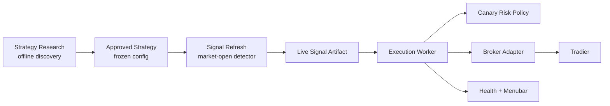
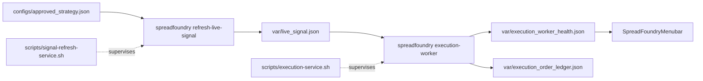

# SpreadFoundry Production Architecture

SpreadFoundry separates offline research from live signal detection and broker
execution. The execution worker never consumes research reports directly and
never recomputes signals.



## Canonical Layers

- `strategy_research`: offline backtests, ranking, diagnostics, and reports.
  It never produces broker-ready orders.
- `approved_strategy`: frozen detector/profile config in
  `configs/approved_strategy.json`.
- `signal_refresh`: market-open job that applies one approved strategy to fresh
  data and writes a typed live signal.
- `live_signal_artifact`: atomic JSON contract at `var/live_signal.json`; this
  is the only input the execution worker may trade from. A database is not used
  yet because the current production handoff has one writer, one reader, and no
  query/lease workload. Move this boundary to SQLite only when we need durable
  history, multiple consumers, replay queries, or leased signal processing.
- `execution_worker`: always-on service that validates mode, risk, broker state,
  preview/place results, ledger idempotency, notifications, and health.
- `execution_decision`: worker output. Mode is separate from status.
- `canary`: risk tier only, currently represented by `CanaryRiskPolicy`.

## Contracts

`ApprovedStrategy` contains the strategy id, profile name, symbols, portfolio
constraints, allowed live strategies, and canary risk policy id.

`LiveSignalArtifact` contains:

- `schema_version`
- `strategy_id`
- `as_of`
- `generated_at`
- `market_data_through`
- `signals`
- `selected_signal`

Signal status is typed as `new_entry`, `already_open`, or `recent_closed`.
Only `new_entry` can become an order attempt. A valid no-trade refresh writes a
fresh artifact with `selected_signal = null`; the worker reports `no_signal`.

Execution decision statuses are mode-independent:

- `no_signal`
- `blocked`
- `ready`
- `reviewed`
- `submitted`
- `already_submitted`
- `rejected`
- `submit_unknown`

Execution modes remain only `monitor`, `review`, and `live`.

## Services



`scripts/signal-refresh-service.sh` starts, stops, and checks the signal
refresh loop. It writes `var/signal_refresh_last.json` for loop health and
`var/live_signal_refresh_last.json` for the latest refresh attempt.
The shell layer is intentionally only service orchestration: launchd/env
loading, logs, state files, timeouts, and scheduling. Market-session checks and
live signal contract validation are Rust code paths.
Refresh runs through the Rust `refresh-live-signal` command, so market-session
checks, approved profile selection, live-signal export, and refresh state are one
typed code path. When Tradier is configured, the refresh market-session gate uses
Tradier's market clock and fails closed if that clock is unavailable. The local
US options calendar remains a fallback for unconfigured/offline checks.
The approved profile, symbol list, and portfolio constraints come from
`configs/approved_strategy.json` rather than service environment overrides.

Current implementation note: signal refresh still invokes the approved
portfolio selector profile to produce the daily live signal. It is deterministic
and does not re-rank strategies, but it is heavier than the target lean
market-open detector. The next architecture cleanup is to extract the approved
signal construction into a small detector module shared by refresh, simulation,
and research.

`scripts/execution-service.sh` starts, stops, configures, and checks the
execution worker. It writes `var/execution_worker_health.json`, logs to
`var/execution_worker.log`, and stores settings in `var/execution_worker.env`.

`scripts/spreadfoundry-service.sh` coordinates signal refresh, execution, and
the macOS menubar.

One-time migration:

```bash
scripts/spreadfoundry-service.sh migrate-legacy
```

This stops old launchd labels and imports saved configuration into the new env
files. The old service scripts are intentionally not kept as aliases.

## Broker Execution

Tradier is the default broker. Robinhood remains available behind the broker
adapter, but live spread execution still requires proven atomic multi-leg
support.

Tradier order flow:

1. Local live signal contract validation.
2. Canary risk policy validation.
3. Ledger idempotency and rejection suppression.
4. Tradier market-clock gate before live order work.
5. Broker buying-power check from current Tradier balances.
6. Position and active-order checks.
7. Current Tradier quote validation for debit spreads, including conservative
   debit, quote side size, and live quote timestamp freshness.
8. Tradier preview.
9. Ledger reservation before place.
10. Autonomous placement stays blocked until broker position reconciliation and
   exit lifecycle are implemented.

Notifications are best-effort and never block monitoring or order handling.

## Menubar

The menubar reads the Rust execution snapshot and exposes:

- `Signal Refresh`
- `Execution`
- `Mode`
- `Broker`
- `Signal`
- `Decision`
- `Account`
- `Buying Power`

Mode changes call `scripts/execution-service.sh set-mode`. The menu never
changes broker configuration or risk policy.

## Operational Commands

```bash
cargo build --release
scripts/signal-refresh-service.sh configure
scripts/signal-refresh-service.sh start
scripts/execution-service.sh start
scripts/menubar-service.sh start
scripts/spreadfoundry-service.sh status
```

Force one refresh:

```bash
scripts/signal-refresh-service.sh once
cargo run --quiet -- live-signal-status --live-signal var/live_signal.json
```

Check whether the current time is an actual configured market session:

```bash
cargo run --quiet -- market-session-status
```

Check execution readiness:

```bash
scripts/execution-service.sh readiness
```

Switch mode:

```bash
scripts/execution-service.sh set-mode monitor
scripts/execution-service.sh set-mode review
scripts/execution-service.sh set-mode live
```

Configure Tradier:

```bash
export SPREAD_TRADIER_ACCOUNT_ID=...
export SPREAD_TRADIER_TOKEN=...
scripts/execution-service.sh configure-tradier production
```
