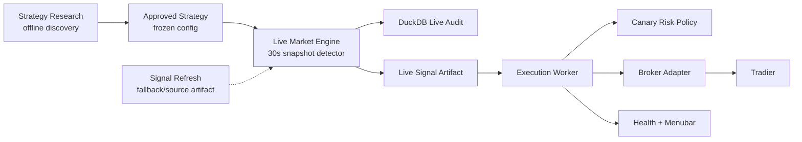
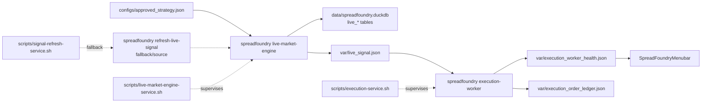

# SpreadFoundry Production Architecture

SpreadFoundry separates offline research from live signal detection and broker
execution. The execution worker never consumes research reports directly and
never recomputes signals.



## Canonical Layers

- `strategy_research`: offline backtests, ranking, diagnostics, and reports.
  It never produces broker-ready orders.
- `approved_strategy`: frozen detector/profile config in
  `configs/approved_strategy.json`.
- `live_market_engine`: always-on market-session detector loop. It consumes a
  provider snapshot, applies the approved strategy gate, writes live audit rows,
  and emits the typed live signal artifact. The first provider is the existing
  signal-artifact adapter; direct chain/quote providers can be added behind the
  same boundary without changing execution.
- `live_signal_artifact`: atomic JSON contract at `var/live_signal.json`; this
  is the only input the execution worker may trade from.
- `live_audit_store`: additive DuckDB live tables for provider health, candidate
  decisions, and emitted snapshots. These rows are observability/audit state,
  not an execution order queue.
- `execution_worker`: always-on service that validates mode, risk, broker state,
  preview/place results, ledger idempotency, notifications, and health.
- `execution_decision`: worker output. Mode is separate from status.
- `canary`: risk tier only, currently represented by `CanaryRiskPolicy`.

## Contracts

`ApprovedStrategy` contains the strategy id, profile name, optional
`research_from`, symbols, portfolio constraints, allowed live strategies, canary
risk policy id, and optional production approval metadata. Signal refresh uses
`research_from` from the approved strategy for approval/research runs, so
production does not silently drift onto a different research window. Live signal
refresh may also set `live_detector_lookback_days`; when present, each market
refresh loads only that recent detector window while relying on the approved
strategy's production approval instead of re-running the multi-year promotion
gate every interval. A selected live entry must have either canary approval or an
explicit operator risk override with an auditable reason. When an override
includes `max_order_max_loss`, the live signal contract rejects selected entries
above that cap.

`LiveSignalArtifact` contains:

- `schema_version`
- `strategy_id`
- `as_of`
- `generated_at`
- `market_data_through`
- `signals`
- `selected_signal`

Signal status is typed as `new_entry`, `already_open`, or `recent_closed`.
`new_entry` can become an entry order attempt. `already_open` can become a
broker management attempt when it has exported execution rules and matches an
approved live strategy. Same-day simulated exits remain `already_open` for live
management because the broker position still has to be closed during that
session; only prior-day exits become `recent_closed`. A valid no-trade refresh
writes a fresh artifact with `selected_signal = null` and no actionable
`already_open` signal; the worker reports `no_signal`.

Execution decision statuses are mode-independent:

- `no_signal`
- `blocked`
- `ready`
- `reviewed`
- `submitted`
- `already_submitted`
- `rejected`
- `submit_unknown`

Execution modes remain only `monitor`, `review`, and `live`.

## Services



`scripts/live-market-engine-service.sh` starts, stops, and checks the live
market engine. It writes `var/live_market_engine_health.json`, appends live
audit rows to `data/spreadfoundry.duckdb`, and writes the execution-compatible
artifact at `var/live_signal.json`. The engine is a snapshot loop, not a
history-scanning research job. Default cadence is `30` seconds and default
source freshness is `420` seconds; stale or unavailable provider input produces
no selected signal.
When `SPREAD_LIVE_ENGINE_ENABLED=1`, `scripts/spreadfoundry-service.sh` keeps
signal refresh running as the source feed but redirects it to
`var/live_signal_refresh_source.json`; the live engine is the only writer of
`var/live_signal.json`.

`scripts/signal-refresh-service.sh` starts, stops, and checks the signal
refresh loop. It writes `var/signal_refresh_last.json` for loop health and
`var/live_signal_refresh_last.json` for the latest refresh attempt.
The shell layer is intentionally only service orchestration: launchd/env
loading, logs, state files, timeouts, and scheduling. Market-session checks and
live signal contract validation are Rust code paths.
Refresh runs through the Rust `refresh-live-signal` command, so market-session
checks, approved profile selection, live-signal export, and refresh state are one
typed code path. When Tradier is configured, the refresh market-session gate uses
Tradier's market clock and fails closed if that clock is unavailable. The local
US options calendar remains a fallback for unconfigured/offline checks.
Refresh is single-flight at the Rust command layer: manual `once` runs and the
scheduled loop share a PID lock, so two selector refreshes cannot race on
their configured live-signal source artifact.
The approved profile, symbol list, and portfolio constraints come from
`configs/approved_strategy.json` rather than service environment overrides. The
current approved config keeps the approval history window at `2023-01-01` and
uses a `30` day live detector lookback for market-session refreshes.
Heavy offline research should not share the live DuckDB writer during market
hours. Use a copied `data/spreadfoundry.duckdb` snapshot with
`SPREAD_RESEARCH_STORE_PATH=/path/to/snapshot.duckdb`; if the snapshot already
contains current cache-window metadata, add
`SPREAD_RESEARCH_STORE_SKIP_CACHE_SYNC=1` so the research job queries the
snapshot coverage tables without rescanning raw Theta cache directories. Missing
coverage still fails normally.
For long ThetaData hydration rounds, run `warm-option-cache-coverage` with
`--progress` so symbol, chunk, timeout, and completed-window progress is emitted
to stderr while JSON stdout remains parseable.

Current implementation note: the live engine's first provider is a
signal-artifact adapter. This moves production onto the always-on detector,
audit, and service boundary immediately while preserving the existing selector
refresh as a rollback/source path. A direct chain/quote provider should replace
the adapter before increasing autonomy or strategy scope.

`scripts/execution-service.sh` starts, stops, configures, and checks the
execution worker. It writes `var/execution_worker_health.json`, logs to
`var/execution_worker.log`, and stores settings in `var/execution_worker.env`.

`scripts/spreadfoundry-service.sh` coordinates live detection, execution, and
the macOS menubar. `SPREAD_LIVE_ENGINE_ENABLED=1` starts signal refresh as the
source writer plus the live market engine as the execution-artifact writer;
`SPREAD_LIVE_ENGINE_ENABLED=0` keeps the older signal-refresh fallback.

One-time migration:

```bash
scripts/spreadfoundry-service.sh migrate-legacy
```

This stops old launchd labels and imports saved configuration into the new env
files. The old service scripts are intentionally not kept as aliases.

## Broker Execution

Tradier is the default broker. Robinhood remains available behind the broker
adapter, but live spread execution still requires proven atomic multi-leg
support.

Tradier order flow:

1. Local live signal contract validation.
2. Canary risk policy validation.
3. Ledger idempotency and rejection suppression.
4. Tradier market-clock gate before live order work.
5. For entries, broker buying-power check from current Tradier balances.
6. Position and active-order checks for the exact supported vertical-spread
   lifecycle.
7. Current Tradier quote validation for supported vertical-spread entries and
   exits,
   including conservative executable side, quote side size for positive-priced
   executable sides, and live quote timestamp freshness.
8. For already-open supported vertical spreads, exported execution rules decide
   whether to hold or close. Debit spreads close for a conservative credit;
   credit spreads close for a conservative debit using the same side-of-book
   model as simulation. Management submits at most one broker action per worker
   poll and relies on the next poll to reconcile fresh broker state before
   another action. If the rules require a close but the broker-safe price is not
   representable as a positive limit, the worker blocks with an explicit manual
   close/expiry/assignment-risk reason instead of sending an invalid order.
9. Tradier preview.
10. Ledger reservation before place.
11. Tradier place and post-submit order confirmation.

Unsupported lifecycle combinations remain fail-closed before placement. For
vertical spreads, broker stock exposure matching assigned short-call or
short-put states is reported explicitly and blocks autonomous recovery until the
operator reconciles the assigned stock and remaining hedge in the broker
account. The current approved production config enables only debit spreads;
credit-spread Tradier lifecycle support is implemented but remains dormant until
research approval and `allowed_live_strategies` explicitly include a credit
strategy.
Guarded wheel management remains one-contract only and is not part of the
approved production strategy set; when enabled, recent closed wheel rows are
also used as broker-reconciliation probes so residual stock or covered-call
inventory is not ignored solely because the simulator marked the row closed.
If the simulator closed the cycle as `covered_call_assigned` / called away but
the broker still reports long stock, the worker blocks for manual
reconciliation before any further wheel order.
When assigned-stock stock-mark/max-hold is due, it previews an equity limit sell
at the current bid before live placement. It recognizes an existing one-contract
covered call from broker positions even if today's exported target changes, so a
previously sold call is not treated as unrelated exposure solely because
research selected a new target. If assigned stock exists but today's export has
no covered-call target, the worker holds intentionally until a future refresh
exports an eligible target or the stock liquidation rule becomes due.
Close-order preview rejections are recorded as retryable `preview_rejected`
observations. `pending_unknown` close ledger entries remain duplicate guards.
Submitted DAY close entries remain guards while active or ambiguous, but become
retryable after broker reconciliation shows the prior close is terminal-unfilled
and exposure still remains. A prior filled close with remaining broker exposure
blocks for manual reconciliation.

Notifications are best-effort and never block monitoring or order handling.

## Menubar

The menubar reads the Rust execution snapshot and exposes:

- `Signal Refresh`
- `Execution`
- `Mode`
- `Broker`
- `Signal`
- `Decision`
- `Account`
- `Buying Power`

Mode changes call `scripts/execution-service.sh set-mode`. The menu never
changes broker configuration or risk policy.

## Operational Commands

```bash
cargo build --release
scripts/live-market-engine-service.sh configure
scripts/signal-refresh-service.sh configure
SPREAD_LIVE_ENGINE_ENABLED=1 scripts/spreadfoundry-service.sh start
scripts/spreadfoundry-service.sh status
```

Run one live-engine cycle:

```bash
scripts/live-market-engine-service.sh once
cargo run --quiet -- live-signal-status --live-signal var/live_signal.json
```

Fallback selector refresh:

```bash
scripts/signal-refresh-service.sh once
```

Check whether the current time is an actual configured market session:

```bash
cargo run --quiet -- market-session-status
```

Check execution readiness:

```bash
scripts/execution-service.sh readiness
```

Switch mode:

```bash
scripts/execution-service.sh set-mode monitor
scripts/execution-service.sh set-mode review
scripts/execution-service.sh set-mode live
```

Configure Tradier:

```bash
export SPREAD_TRADIER_ACCOUNT_ID=...
export SPREAD_TRADIER_TOKEN=...
scripts/execution-service.sh configure-tradier production
```
