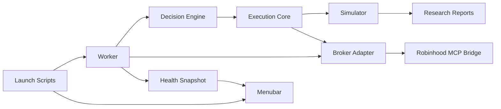

# SpreadFoundry Production Architecture

SpreadFoundry should have one execution model that research, simulation, and live
canary routing all share. The simulator is not a side utility; it is the broker
behavior model used to judge whether a strategy deserves live exposure.

## First Principles

1. Strategy code decides what it wants to do.
2. Execution code decides whether that order is valid and how it fills.
3. Broker adapters translate a validated order intent to a broker surface.
4. Live services can only place what the simulator can represent.
5. UI and service scripts report state; they do not contain trading logic.



## Module Boundaries

- `src/execution.rs`: shared order intents, option legs, conservative fill math,
  and broker-like execution assumptions.
- `src/sim.rs`: scenario simulator that calls `execution` for fills and PnL.
- `src/research.rs`: strategy generation, backtests, ranking, and promotion
  gates. It should move toward calling `execution` for every fill assumption.
- `src/broker.rs`: broker capability checks and Robinhood MCP command execution.
- `src/main.rs`: CLI orchestration and temporary adapter glue. Long-term
  strategy and execution logic should move out of this file.
- `scripts/`: service launch, teardown, and health-check entry points.
- `apps/SpreadFoundryMenubar`: native menubar app that consumes the worker JSON
  snapshot and delegates lifecycle actions to scripts.

## Phase Plan

### Phase 1: Execution Core

Status: implemented.

- Add a Rust execution core for option order intents and conservative fills.
- Route existing put-spread simulator fill math through the execution core.
- Route Robinhood MCP canary payload construction through the same order intent.
- Keep live behavior fail-closed and avoid broad research refactors.

Success criteria:

- Existing simulation tests still pass.
- MCP canary tests still pass.
- Shared execution tests prove bid/ask fill direction, expiration clamping, and
  atomic debit-spread leg shape.

### Phase 2: Simulator-First Research Refactor

Status: first slice implemented.

- Weekly research candidate entry prices and exit fills now call `execution`
  primitives for credit spreads, debit spreads, and cash-secured puts.
- Replay/live parity tests now cover one put debit spread and one cash-secured
  put candidate by mapping the research candidate to an `OptionOrderIntent`.
- Remaining work: make every strategy report its fill model, max loss,
  buying-power reserve, and broker feasibility through shared exported types.

Success criteria:

- No duplicate spread PnL math in research paths touched by canary candidates.
- Research and live canary order previews agree on legs, price effect, and
  limit price for the tested debit and cash-secured put signals.

### Phase 3: Service Runtime

Status: implemented.

- Add start, stop, restart, status, and health scripts for the canary worker.
- Write a stable JSON health snapshot under `var/`.
- Keep teardown explicit and idempotent.

Success criteria:

- `start` creates one worker, `stop` removes it, `status` reports stale/missing
  health clearly, and `restart` is safe to repeat.

Commands:

```bash
cargo build --release
scripts/spreadfoundry-service.sh start
scripts/spreadfoundry-service.sh status
scripts/spreadfoundry-service.sh restart
scripts/spreadfoundry-service.sh stop
```

`spreadfoundry-service.sh` starts the canary worker and menubar. The canary
worker is managed as a macOS LaunchAgent so it survives the launching shell.
`status` calls `spreadfoundry canary-worker-snapshot`, which reads
`var/canary_worker_health.json`, checks `var/canary_worker.pid`, and emits one
JSON object for both CLI operations and the menubar. The script never computes a
trade decision.

### Phase 4: Menubar

Status: implemented.

- Add a small macOS menubar app modeled after AxiomTrade's snapshot-consumer
  pattern.
- Display only useful operational facts: worker state, current action, broker
  mode, live enabled/disabled, last check age, and kill-switch state.
- Keep controls minimal: refresh, open docs/log, stop worker.

Success criteria:

- Menubar reads the same health JSON as CLI status.
- No trading decisions or broker calls are implemented in Swift.

Commands:

```bash
cd apps/SpreadFoundryMenubar
swift build
cargo build --release
SPREAD_ROOT=/Users/1duo/Projects/SpreadFoundry swift run SpreadFoundryMenubar
```

The app renders the Rust snapshot and exposes only `Refresh`, `Start`, `Stop`,
`Restart`, `Log`, `Docs`, and `Quit`.

Essential menubar functions:

- `Status`: show worker liveness, health freshness, current decision, broker
  capability mode, live-order flag, and selected action.
- `Refresh`: force a new read of the Rust canary snapshot.
- `Start`: start the canary worker service without changing trading gates.
- `Restart`: restart the worker after a binary/config update.
- `Stop`: stop the worker fail-closed; no order routing continues.
- `Log`: open `var/canary_worker.log` for operational triage.
- `Docs`: open this architecture/runbook.
- `Quit`: close the menubar only; it does not stop the worker.

Icon design: the menubar uses an original green mark inspired by finance/trading
visual language, not by copying any broker logo. The mark combines an upward
wing/arc with two spread bars to signal gated directional option exposure.

### Phase 5: Continuous Auto-Research

Status: implemented as an opt-in service wrapper.

- Schedule research refreshes through service scripts.
- Store candidate artifacts with provenance and simulator version.
- Require promotion gates before a candidate can reach broker review.

Success criteria:

- A new research result can be traced from data window to simulator version to
  canary artifact to broker review decision.

Commands:

```bash
export SPREAD_AUTO_RESEARCH_COMMAND='cargo run -- run-portfolio-selector-research ...'
scripts/auto-research-service.sh start
scripts/auto-research-service.sh status
scripts/auto-research-service.sh stop
```

The service is inert unless `SPREAD_AUTO_RESEARCH_COMMAND` is set. Each run
writes `var/auto_research_last.json` with start time, finish time, exit code,
and command, plus append-only logs in `var/auto_research.log`. Candidate export
still must pass the existing canary artifact gates before the worker can review
an order.
