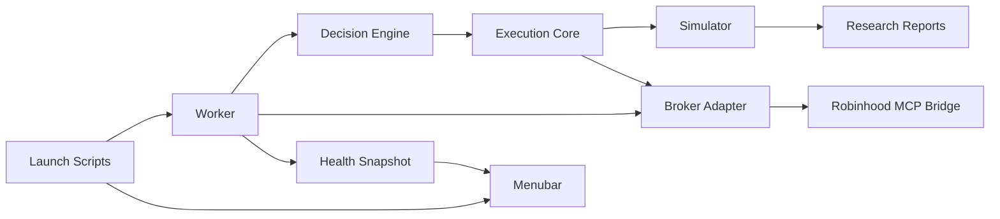

# SpreadFoundry Production Architecture

SpreadFoundry should have one execution model that research, simulation, and live
canary routing all share. The simulator is not a side utility; it is the broker
behavior model used to judge whether a strategy deserves live exposure.

## First Principles

1. Strategy code decides what it wants to do.
2. Execution code decides whether that order is valid and how it fills.
3. Broker adapters translate a validated order intent to a broker surface.
4. Live services can only place what the simulator can represent.
5. UI and service scripts report state; they do not contain trading logic.

## Module Boundaries

- `src/execution.rs`: shared order intents, option legs, conservative fill math,
  and broker-like execution assumptions.
- `src/sim.rs`: scenario simulator that calls `execution` for fills and PnL.
- `src/research.rs`: strategy generation, backtests, ranking, and promotion
  gates. It should move toward calling `execution` for every fill assumption.
- `src/broker.rs`: broker capability checks and Robinhood MCP command execution.
- `src/main.rs`: CLI orchestration and temporary adapter glue. Long-term
  strategy and execution logic should move out of this file.
- `scripts/`: service launch, teardown, and health-check entry points.
- `apps/`: later native menubar app that consumes a JSON health snapshot.

## Phase Plan

### Phase 1: Execution Core

Status: implemented.

- Add a Rust execution core for option order intents and conservative fills.
- Route existing put-spread simulator fill math through the execution core.
- Route Robinhood MCP canary payload construction through the same order intent.
- Keep live behavior fail-closed and avoid broad research refactors.

Success criteria:

- Existing simulation tests still pass.
- MCP canary tests still pass.
- Shared execution tests prove bid/ask fill direction, expiration clamping, and
  atomic debit-spread leg shape.

### Phase 2: Simulator-First Research Refactor

- Move weekly research fill construction onto `execution` primitives.
- Make every strategy report its fill model, max loss, buying-power reserve, and
  broker feasibility through shared types.
- Add replay-vs-live parity tests for at least one debit spread and one
  cash-secured put signal.

Success criteria:

- No duplicate spread PnL math in research paths touched by canary candidates.
- Research and live canary order previews agree on legs, price effect, limit
  price, and max loss for the same signal.

### Phase 3: Service Runtime

- Add start, stop, restart, status, and health scripts for the canary worker.
- Write a stable JSON health snapshot under `var/`.
- Keep teardown explicit and idempotent.

Success criteria:

- `start` creates one worker, `stop` removes it, `status` reports stale/missing
  health clearly, and `restart` is safe to repeat.

### Phase 4: Menubar

- Add a small macOS menubar app modeled after AxiomTrade's snapshot-consumer
  pattern.
- Display only useful operational facts: worker state, current action, broker
  mode, live enabled/disabled, last check age, and kill-switch state.
- Keep controls minimal: refresh, open docs/log, stop worker.

Success criteria:

- Menubar reads the same health JSON as CLI status.
- No trading decisions or broker calls are implemented in Swift.

### Phase 5: Continuous Auto-Research

- Schedule research refreshes through service scripts.
- Store candidate artifacts with provenance and simulator version.
- Require promotion gates before a candidate can reach broker review.

Success criteria:

- A new research result can be traced from data window to simulator version to
  canary artifact to broker review decision.
